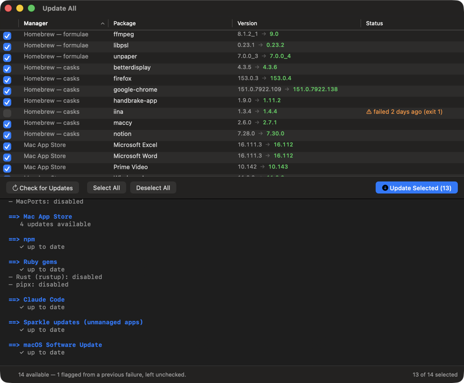
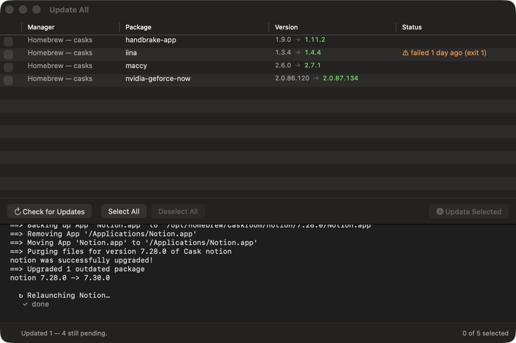
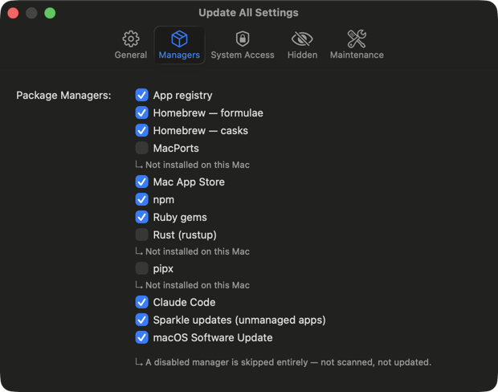
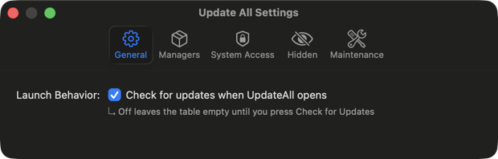
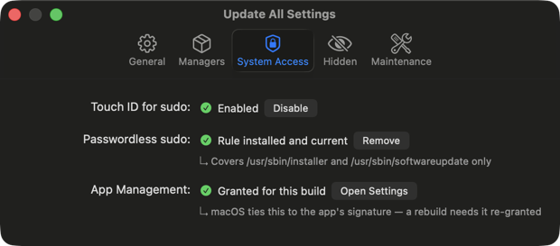
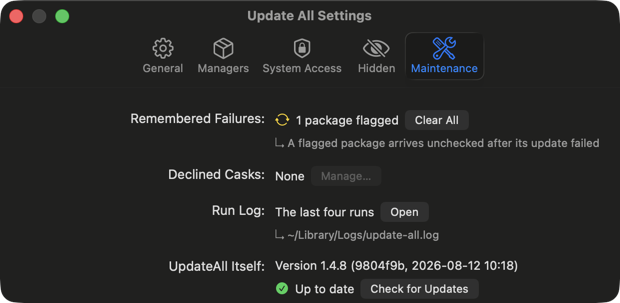

# mac-update-all

A macOS system updater that runs at login and keeps everything current:
Homebrew formulae & casks, Mac App Store, macOS software updates, CLI tools (npm, gem, rustup, pipx, Claude Code), and unmanaged apps via Sparkle feeds.

Ships as a native macOS app (`UpdateAll.app`).

---

## The window

One table of everything that's pending, across every package manager, over a
single console:



- **Check each row individually.** A manager that can target a subset upgrades
  only what's ticked. One that upgrades everything in a single command (macOS
  Software Update, pipx, Claude Code) keeps its rows ticked as a group, so the
  checkbox never promises something the CLI can't honour.
- **Right-click a row** to update just it, clear a failure flag, hide it from
  future scans, disable its manager, or copy its package id.
- **Failure memory.** A package whose update failed comes back pre-flagged and
  unticked — `⚠ failed 3 days ago (exit 1)` — so a known-bad update doesn't
  silently repeat every run. Clearing it, or a success, forgets it.
- **Settings** is a standard preferences window at ⌘, — managers, system
  access, hidden packages, maintenance.

Updating writes to the same console, in order, and an app that's running when
its cask is replaced is offered a clean quit and relaunch first — replacing a
live app bundle otherwise leaves it glitchy until it's restarted. A row that
finishes stays put, greyed and unselectable, so the table becomes the report of
the run; one that failed keeps its reason and can be ticked again. Check for
Updates clears them:



Turn a manager off and it's skipped entirely: not scanned, not updated. One
that isn't installed says so rather than disappearing, so the list always
reflects everything the app knows how to update:



Settings itself is a standard preferences window — icon toolbar, one
pane per section, sized to whichever pane is showing:



macOS gates the two things a system updater has to do — writing to
`/Applications`, and running the installer as root — so both have a row here
with their current state:



---

## What it updates

| Source | Check | Apply |
|--------|-------|-------|
| Homebrew formulae | `brew outdated --formula` | `brew upgrade --formula [names]` |
| Homebrew casks | `brew outdated --cask --greedy` | `brew upgrade --cask` per token |
| MacPorts | `port outdated` | `sudo port upgrade [names]` |
| Mac App Store | `mas outdated` | `mas upgrade <id>` |
| macOS system | `softwareupdate --list` | `softwareupdate --install --all` |
| npm global packages | `npm outdated -g` | `npm install -g <pkg>@latest` |
| Ruby gems | `gem list` + RubyGems API | `gem update <name>` |
| Rust toolchains | `rustup check` | `rustup update` |
| pipx packages | `pipx list --json` + PyPI | `pipx upgrade <name>` |
| Claude Code CLI | `claude --version` + npm registry | `claude update` |
| Unmanaged apps (Sparkle) | appcast feed per app | downloads & installs DMG/ZIP/PKG |

Casks are upgraded one command per token rather than in one batch: brew
prefetches every download first and aborts the whole run if any single one
fails, so one unreachable host used to take down every other cask.

Gems are checked by listing locally and querying the RubyGems API
concurrently. `gem outdated` asks about each gem one at a time — ~60s for 85
gems, nearly all of it idle network wait.

Every manager reports a real answer. Where a CLI has no "what's outdated" mode
(pipx, Claude Code), the installed version is compared against the registry
that publishes it, rather than the app claiming it can't tell — a manager that
can't answer gets a row that says so, arrives unticked, and doesn't count
toward the number of available updates.

---

## App registry (`apps.json`)

On every run, `/Applications` is scanned against the brew/mas lists.
New unmanaged apps are classified automatically:

- **sparkle** — has `SUFeedURL` in `Info.plist` → auto-updated via appcast feed
- **electron** — contains `Electron Framework.framework` → self-updates on launch
- **unmanaged** — everything else (listed for awareness)

If a brew cask exists for an unmanaged app, it's suggested in the output.

The registry is cached in `apps.json` next to the script. Only unmanaged apps are stored — brew/mas lists are re-fetched fresh every run.

---

## Install

One-liner — downloads the latest release, strips the macOS quarantine xattr, and installs to `/Applications`:

```bash
/bin/bash -c "$(curl -fsSL https://cdn.jsdelivr.net/gh/gupfe-priv-dev/apple-app-updater@main/install.sh)"
```

> The URL uses **jsDelivr** instead of `raw.githubusercontent.com` because some corporate proxies aggressively cache the GitHub raw URL and return stale content. jsDelivr's CDN invalidates per commit. The script itself is open — read it before you pipe it.

After install, launch from Spotlight or `open /Applications/UpdateAll.app`.

### Updating UpdateAll itself

The app checks GitHub Releases once per 24 h (cached in
`~/Library/Application Support/UpdateAll/self-update.json`) and puts a newer
release in the window subtitle rather than interrupting with a dialog:

> **Update All – Update available: v1.4.1**

Settings → Maintenance shows the running version and forces an immediate,
un-throttled check:



**Update and Restart** takes the update directly. An app can't cleanly replace
its own bundle while it's running, so the work happens outside it: UpdateAll
writes a script, starts it detached, and quits. The script waits for the
process to exit, downloads the release asset, strips the quarantine flag,
swaps the bundle, and reopens the app — a couple of seconds, no window.

It downloads the asset resolved from the Releases API rather than piping a
remote script into bash, and the previous bundle is moved aside rather than
deleted, so a failed install puts the old version back instead of leaving you
with no app. What it did is in `~/Library/Logs/update-all-selfupdate.log`.

### Versions

Computed by [GitVersion](https://gitversion.net) from the git history, using the
same model as the Windows twin so a version string means the same thing on both:

| Where you are | Version |
|---|---|
| exactly on a release tag | `1.4.8` |
| three commits after it | `1.4.9-preview.3` |

A preview belongs to the version it's heading *towards*, not the one it
followed — `1.4.8` is followed by `1.4.9-preview.N`, then by the `1.4.9`
release. Calling an unreleased build `1.4.8-preview` would claim it came
*before* 1.4.8, when it came after, and the app would offer to "update" it to
the release it was already ahead of.

The self-update check follows semver's pre-release rule accordingly:
`1.4.9-preview.3` is newer than `1.4.8` and older than `1.4.9`, so a preview is
offered its own release but not the one it has passed.

### Code signing

macOS ties the App Management grant to the app's *designated requirement*. An
ad-hoc signature identifies a build by its code hash, which changes every build
— so every rebuild looked like a different app and the grant was revoked.

Settings → System Access → **Code Signing** creates a self-signed certificate in
your login keychain. The hash still changes; the requirement no longer does:

```
identifier "com.gupfe-priv-dev.update-all" and certificate leaf = H"e63c…"
```

Grant App Management once after setting it up, and it stops asking. The
certificate is only needed by whatever *builds* the app — it is never shipped
inside it, and the private key never leaves your keychain.

That keychain does not sync to iCloud, so back the identity up:

```bash
./signing-identity.sh create              # make one (same as the Settings button)
./signing-identity.sh export identity.b64 # base64 of a password-protected .p12
./signing-identity.sh import identity.b64 # restore it on another Mac
./signing-identity.sh export-pem out/     # or as key.pem + cert.pem
./signing-identity.sh import-pem key.pem cert.pem
```

Keep the base64 and its password in a password manager. Anyone holding both can
sign code that macOS will accept as this app.

Releases built by CI are still ad-hoc signed, since the runner has no access to
your key — installing one re-prompts for App Management once.

### Prerequisites

```bash
brew install mas
```

`mas` is the Mac App Store CLI; if it's missing the MAS section is skipped silently.

### Source / development install

If you've cloned the repo and want to build + register a LaunchAgent locally:

```bash
./setup.sh
```

`setup.sh` does everything in one shot — two macOS password dialogs will appear (for writing system files):

| Step | What it does |
|------|-------------|
| Build | Compiles `Sources/**/*.swift` → universal `UpdateAll.app`, ad-hoc code-signs it |
| LaunchAgent | Registers the app to open automatically at login |
| Touch ID for sudo | Writes `/etc/pam.d/sudo_local` so `sudo` prompts with Touch ID instead of a password |
| NOPASSWD sudoers | Writes `/etc/sudoers.d/update-all` so `installer` and `softwareupdate` need no prompt at all |

After setup, `UpdateAll.app` opens at every login with no sudo prompts.
Run manually anytime: `open /Applications/UpdateAll.app`.

---

### How the sudo setup works

**Touch ID (`/etc/pam.d/sudo_local`):**
Enables Touch ID as an authentication method for all `sudo` commands.
The file is included by `/etc/pam.d/sudo` and survives macOS updates.
Written via `authopen` (macOS Authorization framework) which works even if `sudo` is broken.

**NOPASSWD (`/etc/sudoers.d/update-all`):**
Allows `installer` and `softwareupdate` to run as root without any prompt.
These are the only two commands in the script that need root — cask pkg installs and macOS system updates.
Everything else (brew formulae, mas, npm, gem, etc.) never needs root.

---

## Files

| File | Purpose |
|------|---------|
| `Sources/Tool.swift` | The `Tool` protocol every manager implements, plus the availability cache |
| `Sources/Models.swift` | `UpdateItem`, `ScanResult`, `InstallOutcome` |
| `Sources/Tools/` | One file per manager (brew, mas, npm, gem, Sparkle, …) |
| `Sources/Core/Coordinator.swift` | Runs the tools for a scan or a selected install |
| `Sources/Core/History.swift` | Failure memory — which package failed last, and when |
| `Sources/UI/` | Window, updates table, console, settings panes |
| `build-app.sh` | Compiles and signs `UpdateAll.app` (`SKIP_INSTALL=1` to skip installing) |
| `features.sh` | Touch ID / sudoers management (bundled into the app) |
| `SOURCES.md` | Documentation of all data sources (APIs, feed formats, etc.) |
| `apps.json` | Registry of unmanaged apps (auto-generated, gitignored) |

---

## Adding a new update source

Add a file to `Sources/Tools/` implementing `Tool` — `id`, `title`,
`isAvailable()`, `scan()`, `install()` — and list it in `buildToolList()` in
`Sources/AppDelegate.swift`. Implement `install(_:only:)` and set
`supportsTargetedInstall` if the manager can upgrade a subset; otherwise the
default runs the bulk install and the UI groups its rows accordingly.

Two rules worth keeping: never let an unparsed result read as "up to date"
(return `.unknown` and say why), and report per-item failures in
`InstallOutcome.failedItems` so the failure memory stays accurate.

See [`SOURCES.md`](SOURCES.md) for details on the data sources.
